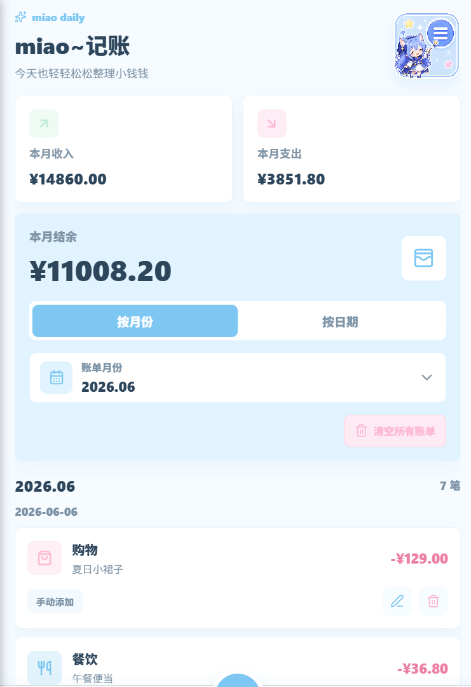
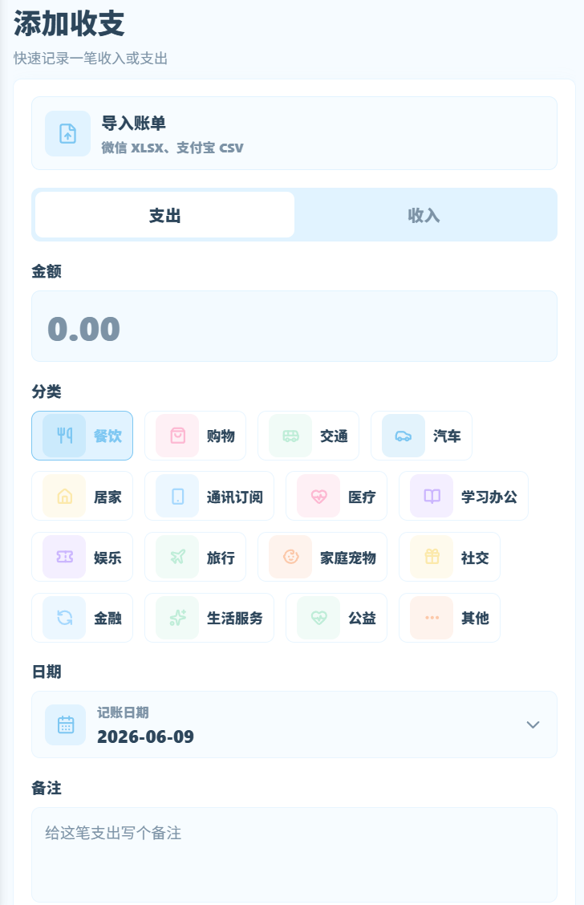
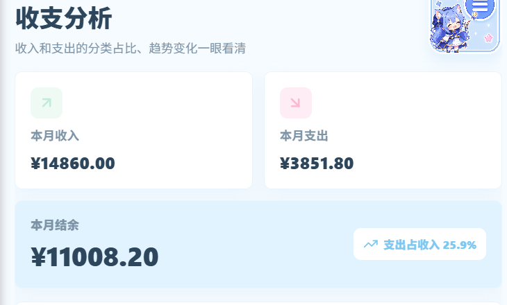
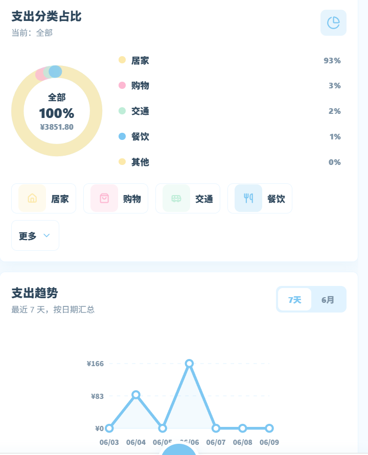
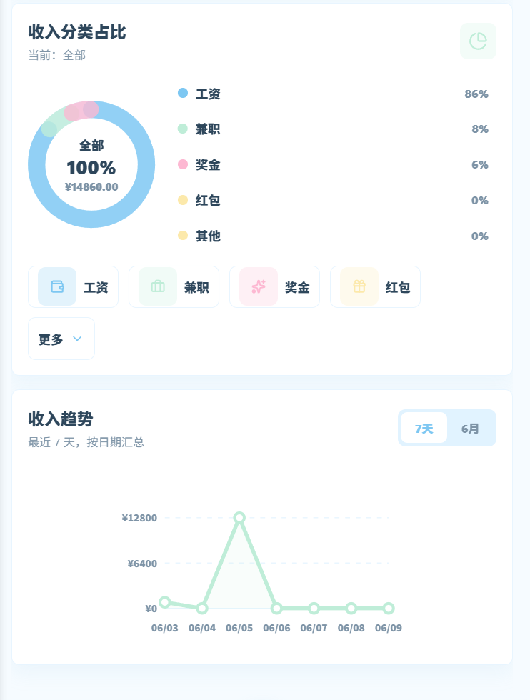
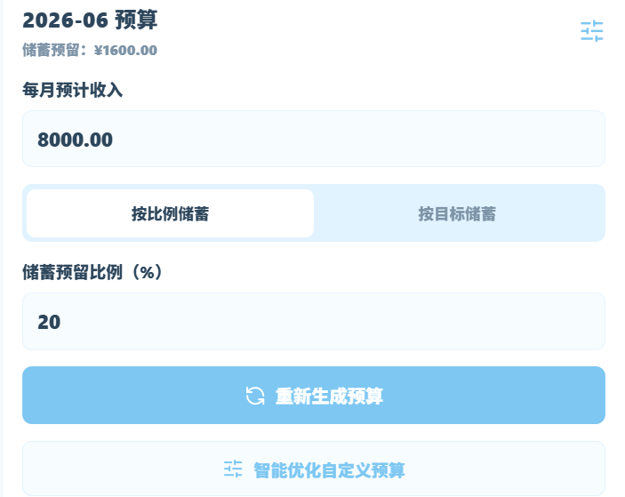
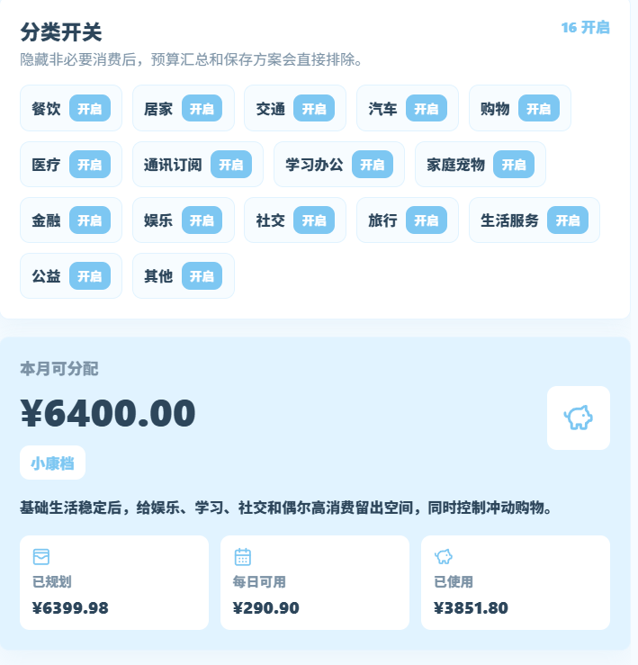
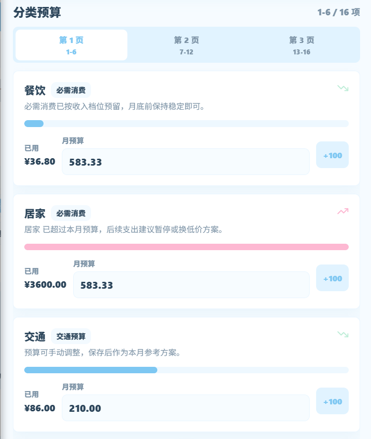
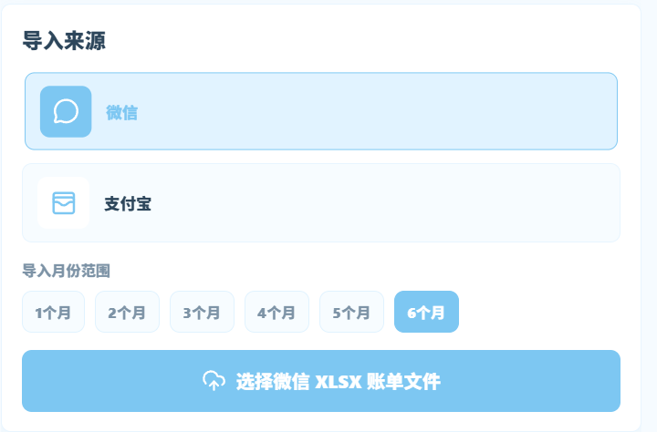

# miao~记账

> miao~一款浅蓝二次元风格的本地手机记账 App。  
> 轻松记录日常收支，自动整理账单，辅助分析消费结构，并根据收入与支出习惯生成更适合当月生活节奏的预算方案。

`miao~记账` 使用 React Native + Expo + TypeScript 开发，主打轻量、清爽、本地可用。当前版本聚焦个人日常记账、账单导入、预算分配、订阅管理、收支分析和汇率换算等核心场景，不依赖登录账号和云同步即可完成主要使用流程。

---

## 项目简介

很多记账软件要么操作复杂，要么只适合单笔手动记录。`miao~记账` 希望把“记账”变成一件更轻松的事情：

- 手动记录一笔支出或收入时，用户可以快速选择分类、日期和备注。
- 已经存在于微信、支付宝中的账单，可以通过文件导入进入 App。
- 导入时系统会自动识别收支方向、金额、时间、商户、备注和分类。
- 固定收入和固定支出可以通过订阅管理每月自动生成。
- 收支分析页面可以展示收入、支出、结余、分类占比和趋势变化。
- 预算分配页面会结合收入档位、固定支出和历史消费结构生成预算建议。
- 汇率计算入口被收纳到快捷菜单中，常用币种可快速换算。

当前版本是本地版功能升级阶段，重点是把个人记账、导入、分析、预算和订阅提醒做完整、做稳定。

---

## 六大功能板块

### 1. 我的账单

`我的账单` 是 App 的首页，用于集中查看当月收支情况和账单明细。

主要能力：

- 展示本月收入、本月支出和本月结余。
- 支持按月份或按日期查看账单。
- 展示每日账单列表，区分收入和支出。
- 支持编辑、删除单条账单。
- 支持清空本机所有账单，方便测试或重新开始记账。
- 底部中间悬浮加号可快速进入添加收支页面。

首页适合用户每天打开 App 时快速了解“这个月赚了多少、花了多少、还剩多少”。

---

### 2. 添加收支与账单导入

`添加收支` 页面用于快速记录一笔收入或支出，同时也是外部账单导入入口。

主要能力：

- 支持收入 / 支出切换。
- 支持金额、分类、日期、备注录入。
- 支持常见支出分类，如餐饮、购物、交通、汽车、居家、通讯订阅、医疗、学习办公、娱乐、旅行、家庭宠物、社交、金融、生活服务、公益、其他。
- 支持常见收入分类，如工资、兼职、奖金、红包、退款、收款、二手转卖、其他等。
- 支持微信账单 XLSX 导入。
- 支持支付宝账单 CSV 导入。
- 导入后自动识别收支方向、金额、日期、交易对方、商品说明、备注和分类。
- 导入时会进行重复账单识别，避免同一笔账单被重复入账。
- 低置信度分类或疑似重复账单会进入预览确认，由用户手动修正。

导入能力依赖本地解析和本地分类知识库，不需要把账单上传到云端。

---

### 3. 收支分析

`收支分析` 页面用于把账单数据整理成更直观的消费视图。

主要能力：

- 展示本月收入、本月支出、本月结余。
- 展示支出占收入比例，帮助判断消费压力。
- 展示支出分类占比，快速发现高消费分类。
- 展示收入分类占比，了解工资、兼职、奖金、红包等收入结构。
- 支持查看最近 7 天或本月的收入 / 支出趋势。
- 使用图表展示分类占比和趋势变化。

该页面适合用户复盘消费结构，例如发现“居家支出过高”“餐饮消费增长明显”“本月收入主要来自工资”等情况。

---

### 4. 预算分配

`预算分配` 是当前版本新增的核心功能板块，用于根据用户收入和消费习惯生成当月预算。

主要能力：

- 用户输入每月预计收入。
- 支持按储蓄比例或储蓄目标预留资金。
- 根据收入档位生成不同预算策略。
- 自动扣除固定订阅、房租、话费等固定支出。
- 结合上月消费结构微调分类预算。
- 自动计算本月可分配金额和每日可用预算。
- 展示每个分类的月预算、已用金额和预算进度。
- 支持用户手动调整分类预算。
- 支持智能优化自定义预算，让手动预算重新平衡到更合理的结构。
- 支持保存预算方案，再次进入页面时自动回读。

预算策略会区分基础生活、必要消费、交通、弹性消费和其他消费。低收入档位会优先保障餐饮、居家、交通、通讯、医疗等基础需求；收入越高，系统会给购物、娱乐、旅行、社交等弹性消费留下更多空间。

---

### 5. 订阅管理

`订阅管理` 用于管理每月固定收入和固定支出，例如房租、工资、会员费、话费等。

主要能力：

- 支持创建固定收入订阅，如工资入账。
- 支持创建固定支出订阅，如房租、视频会员、通讯套餐等。
- 每个订阅每月只自动生成一次账单。
- 支持开启或暂停订阅。
- 支持编辑、删除订阅。
- 支持订阅提醒，默认提前 3 天中午 12:00 提醒。
- 支持为每个订阅单独调整提醒开关、提前天数和提醒时间。
- 删除或关闭订阅时，会同步处理后续提醒和相关账单刷新。

该功能适合处理“每个月都固定发生”的账单，减少重复手动输入。

---

### 6. 快捷菜单与汇率计算

`快捷菜单` 用于收纳不适合作为底部主 Tab 的常用工具，当前版本主要包含汇率计算。

汇率计算主要能力：

- 支持常见币种换算：CNY、USD、EUR、JPY、HKD、GBP、KRW 等。
- 支持源币种和目标币种切换。
- 支持离线优先使用最近缓存汇率。
- 页面展示缓存状态和常见币种汇率。
- 请求失败时可回退到最近历史缓存。

汇率功能从底部导航迁移到右上角快捷菜单后，底部导航更加聚焦记账主流程。

---

## 产品特点

### 支持微信、支付宝账单导入

当前版本支持：

- 微信支付账单：`XLSX`
- 支付宝交易明细：`CSV`

导入流程会自动完成文件读取、模板识别、字段归一化、分类识别、重复检测和预览确认。对于高置信度且非重复的账单，可以直接进入自动导入流程；对于低置信度或疑似重复的账单，会交给用户确认。

### 本地分类知识库

系统内置本地分类关键词库，并支持用户学习规则。

例如：

- `蜜雪冰城`、`瑞幸咖啡`、`美团外卖` 可识别为餐饮相关支出。
- `地铁`、`公交`、`哈啰骑行` 可识别为交通相关支出。
- `花呗还款`、`信用借还` 可识别为金融相关支出。
- `退款成功`、`原交易退回` 可识别为退款收入。

当用户手动修正分类后，系统会把用户选择写入本地学习规则。用户规则优先级高于系统规则，下次遇到相似账单时会优先使用用户偏好。

### 智能预算分析

预算分配不只是按照上月比例简单复制，而是综合考虑：

- 每月预计收入。
- 储蓄比例或储蓄目标。
- 固定订阅和固定支出。
- 上月消费结构。
- 当前月份已用金额。
- 不同收入档位下的基础生活优先级。

系统会优先保障必要消费，再给弹性消费分配空间，帮助用户在“能生活得稳定”和“能有适当娱乐”之间找到平衡。

### 智能订阅管理

订阅管理可以把每月固定发生的账单自动化：

- 工资每月自动记为收入。
- 房租每月自动记为支出。
- 视频会员、通讯套餐等可以按月生成账单。
- 提醒默认提前 3 天中午 12:00，避免忘记续费或扣款。

### 收支分析图表

收支分析页面提供分类占比和趋势图，帮助用户发现消费重点和变化趋势。预算页也会根据真实账单刷新已用金额，删除账单、清空账单、导入账单或订阅生成账单后，预算统计会跟随更新。

### 本地优先，不依赖云端

当前阶段不实现登录、云同步、云端 AI 分类和小票识别。账单、预算、分类知识库和订阅数据优先保存在本地数据库中，更适合作为个人本地记账工具使用。

---

## 技术栈

- Expo
- React Native
- TypeScript
- Expo Router
- SQLite / Drizzle ORM
- Zustand
- NativeWind
- react-native-gifted-charts
- react-native-safe-area-context
- lucide-react-native
- expo-document-picker
- expo-file-system
- expo-notifications
- xlsx
- papaparse

---

## V2.0版本BUG修订

1.已修复点击支持收入趋势，有时候信息会挡住线，导致无法点击。

2.已修复手机如果设置为经典栏，栏位不会消失，会进行遮挡。
